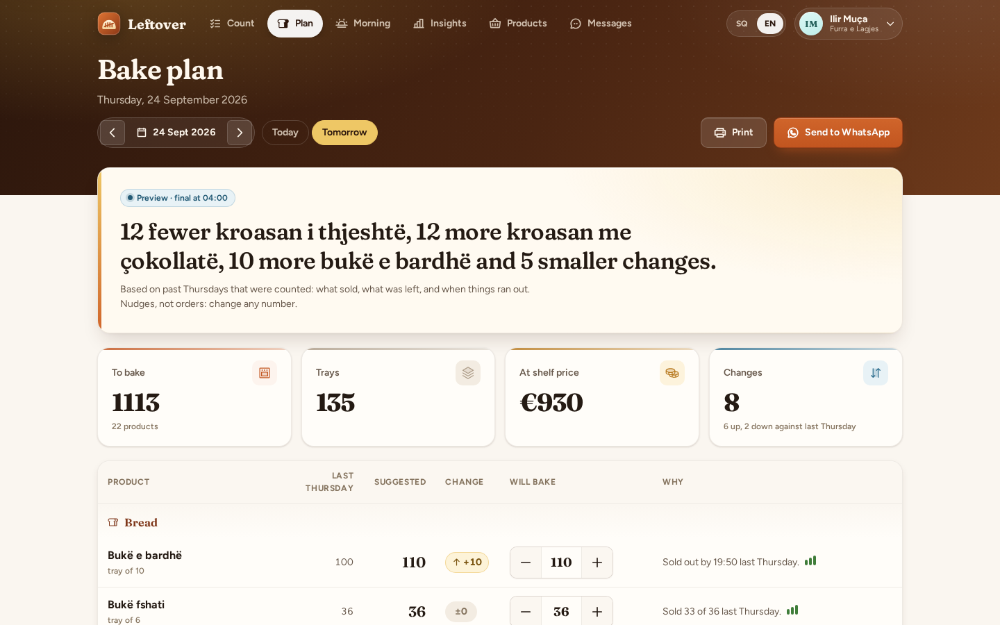
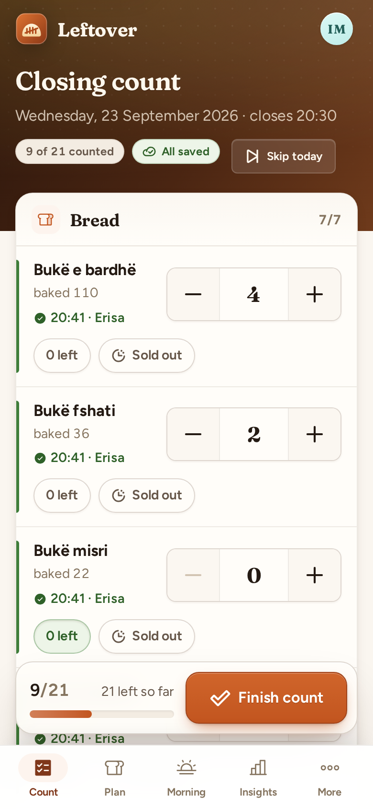
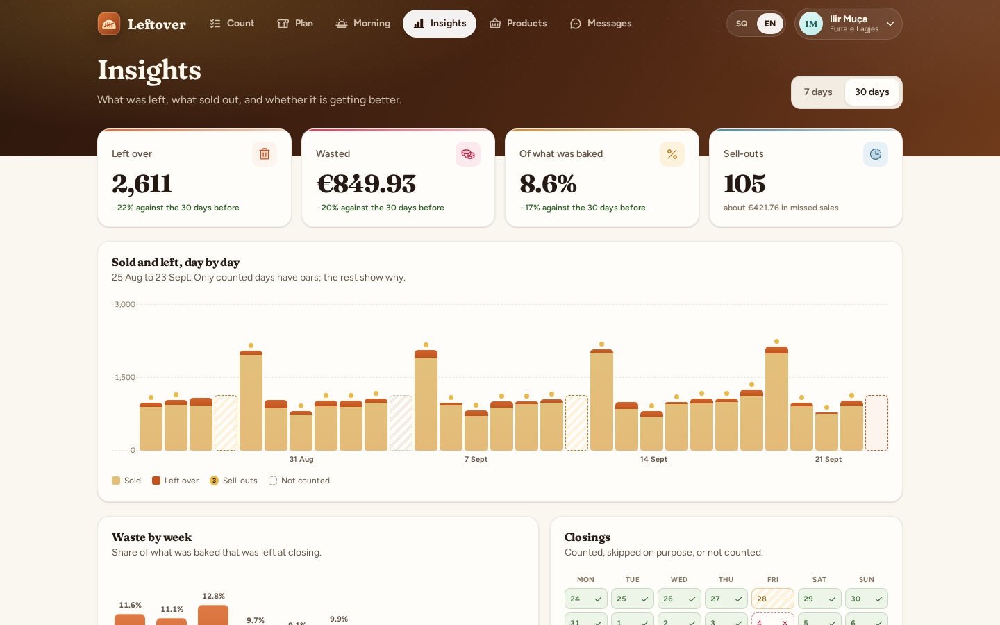
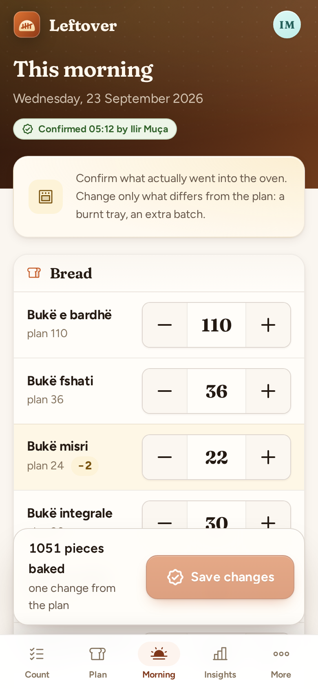
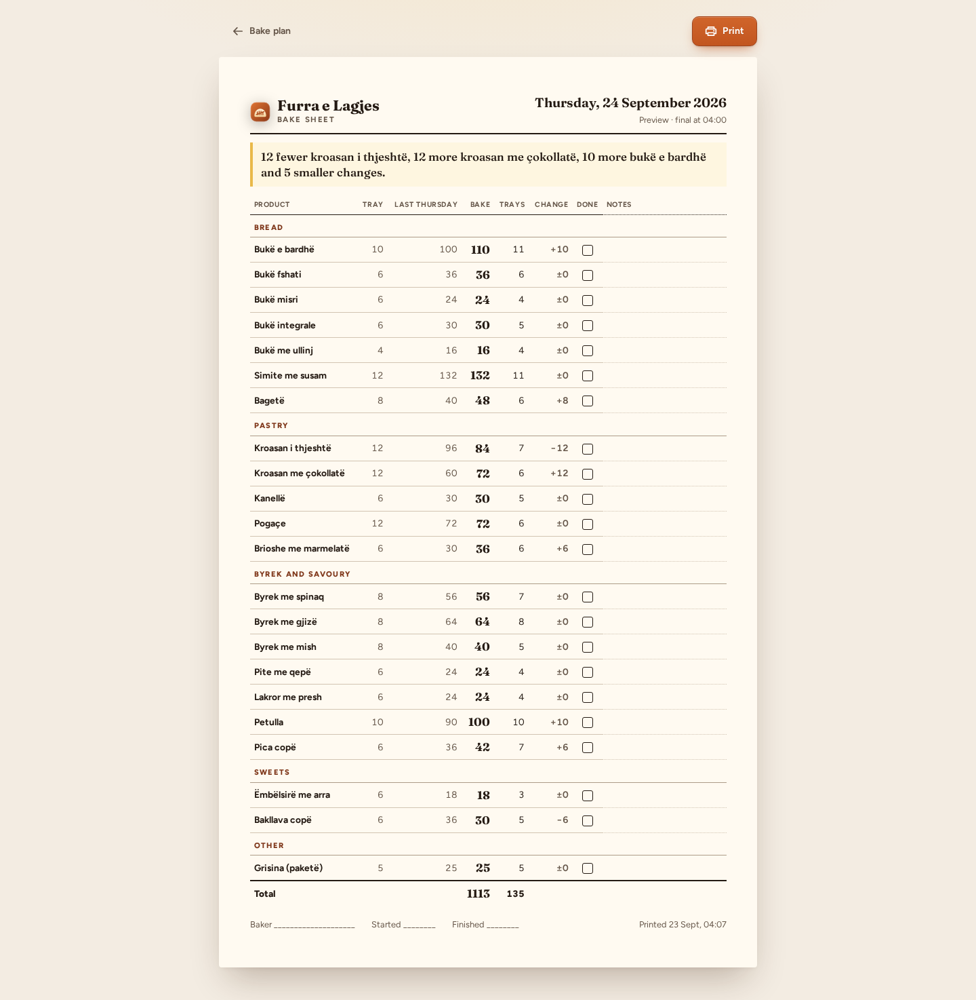
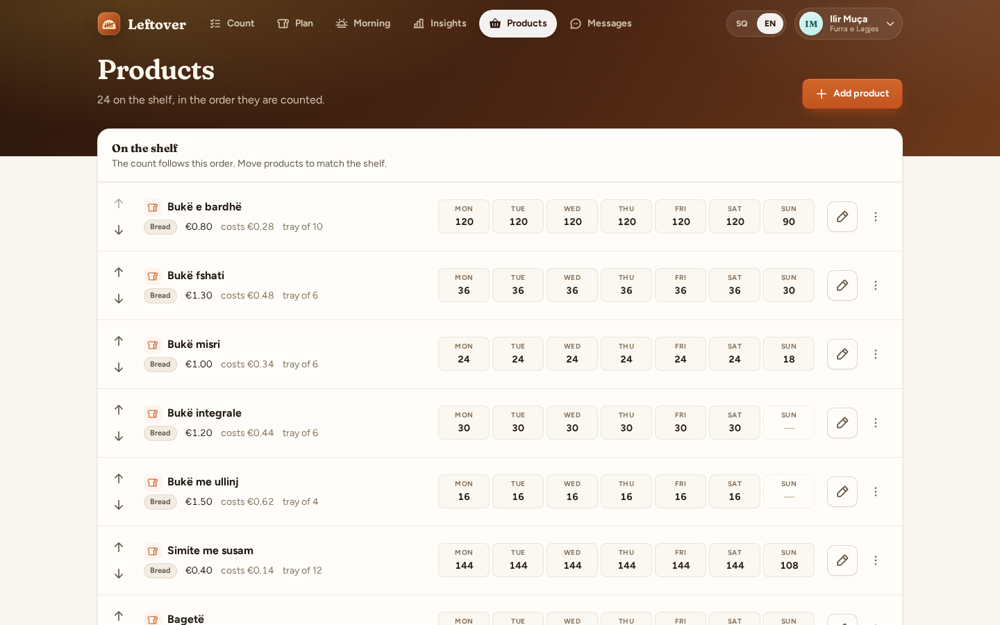

# Leftover

A 40-second closing count for a small bakery, and a 4 a.m. bake plan that gets a little less wrong every week.

<table>
  <tr>
    <td width="72%"></td>
    <td width="28%"></td>
  </tr>
</table>

## Why

A small bakery decides at 4 a.m. how many of each of 20–40 products to bake, by feel. What is left at closing
is thrown away, given away or sold at half price, and a sell-out at 10 a.m. is a lost sale nobody sees. Nobody
writes either number down, so the same Monday over-bake and Saturday under-bake repeat for years, and 8–15% of
production going to waste is treated as normal. The till counts sales, never what was left, and a sell-out looks
like nothing happened. The forecasting tools the chains buy need a POS integration; the bakery with one shop has
neither. Leftover needs a phone at closing and WhatsApp at 4 a.m.

## What it does

- **Closing count on the phone.** Products in shelf order, grouped by category. For each one: what was baked, a
  big stepper for what is left, a "0 left" shortcut and a "Sold out" chip that asks roughly when (before 10,
  10–12, 12–15, after 15, or an exact time). Type a number and Enter jumps to the next product.
- **Every change is saved on its own**, one request per product, so a phone call mid-count loses nothing. Offline,
  changes queue on the phone (localStorage), the screen says so, and they go out when the connection returns.
- **Finish count** shows what the day left behind: pieces left, € wasted at cost, sell-outs, the worst
  leftovers. Products nobody counted stay blank; they are never read as zero. A day can be **skipped with a
  reason**, and if yesterday was not counted the next count says so and offers to catch up or skip it.
- **Bake plan for any day** (today's before noon, tomorrow's after): per product the suggestion, the change
  against the same weekday last week, the reason in plain words ("7 left over on each of the last two Mondays",
  "Sold out by 10:20 last Saturday"), a confidence meter, and the whole plan in one sentence: *"12 fewer kroasan
  i thjeshtë, 12 more kroasan me çokollatë, 10 more bukë e bardhë and 5 smaller changes."*
- **The baker has the last word.** "Will bake" is editable; the suggestion stays next to it, so the history keeps
  both what the app said and what was baked.
- **A printable bake sheet** for the wall (tray counts, a box to tick, room for notes) and **Send to WhatsApp**
  with a preview of the exact message.
- **This morning**: confirm what actually went into the oven. It defaults to the plan; change only the burnt tray.
- **Insights**: waste over 7 or 30 days against the period before (pieces, €, share of production), missed sales
  estimated from sell-outs, sold vs left per day (skipped and uncounted days are drawn as what they are), waste
  by week, a calendar of closings, a sell-out log ("Simite me susam sold out before 11:00 on 3 of the last 4
  Saturdays") and a per-product table with trends.
- **Products**: shelf order with up/down controls, shelf price and cost, tray size, the usual number for each
  weekday, baking days, archive and restore.
- **Two daily WhatsApp messages**, each at most once a day: the plan at plan time (04:00 by default, made then if
  nobody made it earlier) and "count what's left" a set time after closing if nobody has counted, to counter
  staff (or the owner when no staff member has a phone).
- **Two roles**: the owner (everything) and counter staff (count, read the plans). Staff join with a link.
- **English and Albanian** throughout; WhatsApp messages go out in the recipient's language.

<table>
  <tr>
    <td width="72%"></td>
    <td width="28%"></td>
  </tr>
  <tr>
    <td></td>
    <td></td>
  </tr>
</table>

## How it works

The forecast is plain arithmetic, deliberately (`backend/app/Forecast/ForecastService.php`). For product P on
date D:

1. Take the last up to **six same weekdays that were counted**. Days that were skipped or never counted are left
   out, not read as zero, which is how the plan survives a forgotten count.
2. Demand on each of those days is **baked − left**. A sell-out hides demand, so a day that ran out at time T is
   scaled up by *minutes open that day ÷ minutes open until T*, kept between **1.05 and 1.6**.
3. Recent weeks weigh more: **0.35, 0.25, 0.17, 0.11, 0.07, 0.05**, renormalised over the days available.
4. With fewer than three counted days the result is blended with the baker's usual number for that weekday
   (one day: one third data, two thirds habit; two days: two thirds data). With none, the usual number is used.
5. The result is **rounded up to whole trays**, never below zero, and nothing is suggested on a day the product
   is not baked.

Each suggestion carries its change against what was baked on the same weekday last week, a confidence from the
number of counted days (0–2 low, 3–4 medium, 5–6 high), and one reason chosen to agree with the direction of the
change: a bigger number is explained by sell-outs, a smaller one by leftovers. The headline names the three
biggest changes and "the rest as usual" or how many smaller changes remain.

A plan is a live preview until it is made, at plan time or the first time the baker changes or sends it. From
then on its numbers and reasons are stored with the day, so a past plan still explains itself. Waste is valued
at the product's cost (its shelf price when no cost is set); missed sales are the sell-out uplift times the price.

The demo bakery, *Furra e Lagjes* in Blloku, replays ten weeks through this same code: every morning the real
forecast makes the plan from the counts so far, and a hidden demand (strong Saturdays, weak Mondays) decides what
sells and when things run out. For four weeks Ilir only counts and bakes by habit (Monday leftovers, Saturday
sell-outs before eleven); after that he follows the plan, Saturday sell-outs move towards closing time and waste
falls from about 12% of what was baked to about 8%.

## Stack

- **Backend**: Laravel 12 (PHP 8.2), PostgreSQL, Sanctum cookie sessions, scheduled jobs in `routes/console.php`,
  WhatsApp Cloud API driver with an outbox.
- **Frontend**: Vue 3.5, Vite, TypeScript, Pinia, vue-router, vue-i18n, Phosphor icons, Fraunces and Figtree.
  Installable as a PWA.

## Run it locally

Prerequisites: PHP 8.2 with `pdo_pgsql`, Composer, Node 22, PostgreSQL 14+.

```bash
# database
createuser -P leftover            # password: leftover
createdb -O leftover leftover
createdb -O leftover leftover_test

# backend (http://127.0.0.1:8112)
cd backend
composer install
cp .env.example .env
php artisan key:generate
php artisan migrate --seed        # demo bakery with ten weeks of history
php artisan serve --port=8112
php artisan schedule:work         # in a second terminal: the 04:00 plan and the closing reminder

# frontend (http://localhost:5112)
cd frontend
npm install
BACKEND_URL=http://127.0.0.1:8112 PORT=5112 npm run dev
```

Demo logins (password `demo1234`): **demo@leftover.test** (Ilir Muça, owner) and **staff@leftover.test** (Erisa
Hoxha, counter staff). In demo mode Settings → Daily messages has "Run now" buttons for both jobs.

## Configuration

Everything lives in `backend/.env` (see `.env.example`).

| Variable | What it does |
| --- | --- |
| `APP_PUBLIC_URL` | Where people open the web app; links in WhatsApp messages point here. |
| `APP_DEMO` | Seeds the demo bakery and shows the "Run now" buttons. |
| `MESSAGING_DRIVER` | `log` (default) keeps messages in the in-app outbox; `whatsapp` sends through the Cloud API. |
| `WHATSAPP_TOKEN`, `WHATSAPP_PHONE_NUMBER_ID`, `WHATSAPP_APP_SECRET`, `WHATSAPP_VERIFY_TOKEN` | WhatsApp Cloud API credentials and webhook secrets. |
| `WHATSAPP_TEMPLATE_BAKE_PLAN`, `WHATSAPP_TEMPLATE_COUNT_REMINDER` | Approved templates for the two messages the bakery starts, as `template_name\|param,param`. Parameters are the message's placeholders, e.g. `leftover_plan\|name,day,headline,total,link` and `leftover_count\|name,time,link`. |
| `ANTHROPIC_API_KEY` | Not used by Leftover (the kit supports it); nothing here needs AI. |

Without WhatsApp credentials every message still gets written, in the recipient's language, to **Messages**, with
an "Open in WhatsApp" link that sends it from your own phone. Business-initiated WhatsApp messages need approved
templates; without the template variables the driver sends plain text, which WhatsApp only delivers inside a
24-hour conversation window.

## Tests

```bash
cd backend && php artisan test      # 89 tests
cd frontend && npm run type-check && npm test && npm run build-only
```

- **Forecast unit tests**: censoring uplift and its bounds, recency weights and renormalisation, only six days,
  baseline blending, tray rounding, never below zero, inactive weekdays, confidence, and every reason, in both
  languages.
- **API feature tests**: per-product autosave of the count, sell-outs, finishing and skipping (a skipped day is
  refused until undone), plan previews that ignore skipped and uncounted days, overrides, the morning
  confirmation, WhatsApp sending, both daily jobs run twice (made and sent once), staff permissions (no product
  edits, no plan changes), and tenant isolation.
- **Frontend unit tests**: the offline count queue, local summaries, shop-time dates and Albanian formatting.

## Project structure

```
backend/
  app/Forecast/        the forecast, its reasons and the plan headline (pure, no database)
  app/Bakery/          plans, counts, insights, the shop clock, the two daily jobs
  app/Http/Controllers/
  database/seeders/DemoSeeder.php   ten weeks replayed through the real forecast
  lang/{en,sq}/        API texts, reasons and WhatsApp templates
  routes/console.php   the scheduled jobs
frontend/
  src/views/           Count, Plan (+ print sheet), Morning, Insights, Products, Messages, Settings
  src/components/      count/, plan/, insights/, products/, settings/, ui/ (shared kit components)
  src/lib/count.ts     the offline queue and local count summaries
  src/stores/countSync.ts   autosave that survives reloads and lost connections
  src/i18n/            en.ts and sq.ts
```

## License

MIT, see [LICENSE](LICENSE).
